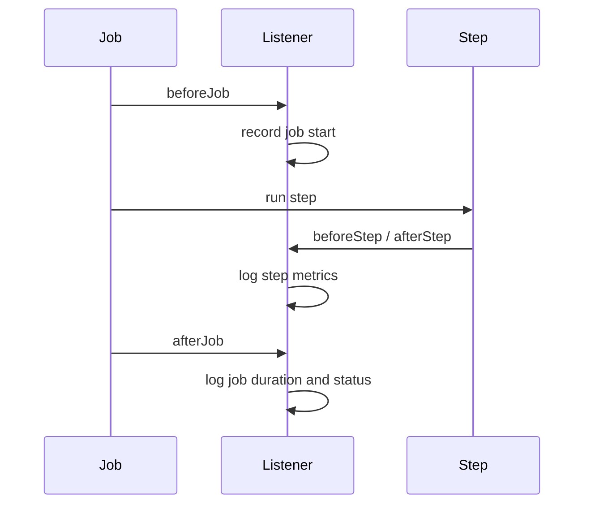

# 성능 지표 분석 리스너 추가 플랜

## 목표

- Job·Step 실행 시간, 처리 건수(read/write/skip), 초당 처리량(throughput) 등을 수집해 로그로 출력하는 리스너 추가

## 수집할 지표

| 구분 | 지표 | 출처 |
|------|------|------|
| Job | 실행 시간, 최종 상태(SUCCESS/FAILED) | JobExecution |
| Step | 실행 시간, read count, write count, skip count, commit count | StepExecution |
| Step | 처리량 (write count / 소요 초) | 계산 |

## 구현 방식

Spring Batch의 **JobExecutionListener**, **StepExecutionListener**를 구현한 단일 리스너 클래스를 만들고, Job·Step 빌더에 등록한다.

- **JobExecutionListener**: `beforeJob` / `afterJob`에서 Job 시작·종료 시각과 종료 상태 로그
- **StepExecutionListener**: `beforeStep`에서 시작 시각 저장, `afterStep`에서 StepExecution의 read/write/skip/commit count와 소요 시간·throughput 로그

## 변경할 파일

### 1. 신규: BatchPerformanceListener.java

- `org.springframework.batch.core.JobExecutionListener`, `StepExecutionListener` 구현 (Spring Batch 6 패키지: `org.springframework.batch.core` 기준).
- **beforeJob**: job 시작 시각 저장 (필드 또는 StepContext 활용).
- **afterJob**: job 소요 시간(ms), ExitStatus 로그.
- **beforeStep**: step 시작 시각 저장.
- **afterStep**:
    - `StepExecution`에서 `getReadCount()`, `getWriteCount()`, `getSkipCount()`, `getCommitCount()`
    - `getStartTime()`, `getEndTime()` 또는 `getLastUpdated()`로 소요 시간 계산
    - 처리량 = writeCount / duration(초)
    - 로그 레벨 INFO로 step 이름·소요시간·read/write/skip/commit·throughput 출력.
- 단순화를 위해 `@Component`로 빈 등록 후 Config에서 주입해 사용.

### 2. 수정: BatchJobConfig.java

- `BatchPerformanceListener` 주입.
- **Job 빌더**: `.listener(batchPerformanceListener)` 추가 (JobExecutionListener로 등록).
- **Step 빌더** (dataProcessingStep): `.listener(batchPerformanceListener)` 추가 (StepExecutionListener로 등록).
    - dataInitializationStep, failStep에도 동일 리스너를 걸어서 모든 Step 지표를 한 곳에서 수집할 수 있게 할지 선택 가능(플랜에서는 dataProcessingStep만 명시, 필요 시 다른 Step에도 동일 방식 적용).

## 참고

- StepExecution의 `getEndTime()`이 null일 수 있으므로, afterStep에서는 `Instant.now()` 또는 `StepExecution.getLastUpdated()`로 종료 시각을 보완해 duration 계산.
- 리스너는 싱글 스레드 Step 실행 기준으로 동작하면 되며, 동시 Step 실행은 고려하지 않아도 됨(필드에 step별 시작 시각을 저장할 경우 Step 이름을 키로 사용하면 확장 가능).
